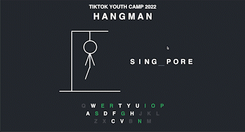

# Hangman
## Group Members:
  Bethany Low, April Chan, Elton Goh, Giorgio Canalella
  
##  Planning
###    Milestones & Timeline
    
    - 21 May 2022: Meet to discuss project and allocation of work
    
    - 22 May 2022: Finish basic HTML structure
    
    - 24 May 2022: Add CSS Stylings
    
    - 24 May - 28 May: Incorporate JavaScript
    
    - 29 May: Cleanup
  
##  Work Allocation
  
  Due to the nature of the project, the different levels of coding knowledge of group members, and the fact that all group members were very busy on internships, not much time could be allocated to collaborating and discussing on the project. Hence, we decided that we would work on the project in our own time according to our own abilities, instead of allocating specific portions to each person.
    
## Technical Documentation

Technology used: ReactJS

###  Why
Prior to this project, our group had extremely limited experience with React. Since Hangman is a relatively small project which can work without a database, we decided that this would be a great opportunity to practice structuring React projects from scratch, and develop our understanding of how the lifecycle of React components.

### Snippet of Interesting Code:

This block of code is the backbone of our hangman app. It handles the guessing, lifecycle, and UI/UX throughout the entire game!

It was difficult to decide how to go about accepting both keyboard events and clicking of the displayed keyboard, yet avoid passing props from child to parent components and keeping our code DRY. Accepting both was important to provide support for both laptop and tablet/mobile without changing the overal aesthetic of the app. We decided on an approach that triggered a keyboard event which is handled by the parent component.

## Project Video:

## Project Screenshots:
### Laptop Support

### Mobile and Tablet Support

## Project Retrospective:

###   What went well:
We were able to successfully create the hangman game with full functionality.

###   What can be improved:
Since our interface is rather static right now, we feel like a key improvement could be to add better and more interactive animations to add to the engagement of the game and make it more fun. 

For example, we could incorporate a "hints" function into the game that provides the user with context about the word to be guessed, or, instead, allow users to pick a category of words before starting the game. Since we are currently generating our hangman word from a fixed array of words, we plan to integrate an external library to help generate the words instead. This will allow for many more different words to be included in the game. When the game is over, users currently have to refresh the page to play it again - this could be improved by adding a "play again" button, which starts the game again. 

Finally, we could incorporate a multiplayer element to allow multiple users to play together at the same time. Since most people associate hangman with playing it with a friend, an addition like this could increase user experience and attract more players.

###   What will we commit to improve in the next project:
As we feel like a good user interface is key to the success and enjoyment of the hangman game, we will commit to improving the interface of the game in the next iteration of the project. These additions could come in the form of advanced animations with regards to the hangman itself. For example, the hangman could be drawn to better emulate the experience of playing the game on paper with a friend.